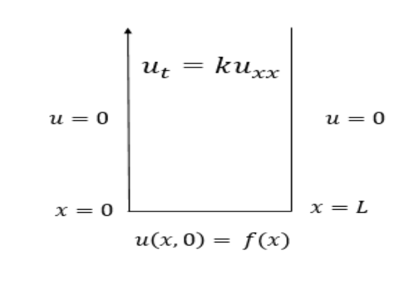

# Lid Driven Cavity Incompressible Navier Stokes Equation Solution

  

Solution to the incompressible Navier Stokes Equations in a Lid-Driven Cavity using finite differences, explicit timestepping and Chorin's Projections. 

# Method
Section describes the equations and method used to write up the simulation. 

## basic equations

The solution is based off Navier Stokes Equation particularly:

$$\frac{\partial u}{\partial t} + (u \cdot \nabla)u = \frac{-1}{\rho} \cdot \nabla \rho + \nu \cdot \nabla^{2}u + f $$

Incompressibility Equation in the simulation is based on:

$$\nabla \cdot u = 0 $$ 

where:
 - u: Velocity (assumed to be a 2D vector)
 - p: pressure
 - f: Forcing
 - $\rho$: Density 
 - $\nu$: Kinematic Viscosity 
 - t: Time
 - $\nabla$: Nonlinear Convection as well as divergence and gradient
 - $\nabla^{2}$: Laplace Operator 

 The box will start the simulation as a Homogenuous Dirichlet Boundary Condition as seen below : 

  

There are also a few assumptions we will make:
- Velocity and Pressure have zero initial condition
- There is homogenuous Dirichlet boundary conditions everywhere except for horizontal velocity at top. It is driven
by external flow.

## solution

The solution is inspired by the Projection Method, or in other words, *Chorin's Splitting*.

The simulation starts off by setting velocities as:

$$ u = [u, v]$$

$$ x = [x, y]$$

1) The simulation solves the Momentum Equation without a Pressure Gradient for tentative velocity given boundary conditions:

$$\frac{\partial u}{\partial t} + (u \cdot \nabla) \cdot u = \nu \nabla^{2}\cdot u $$

$$\frac{\partial u}{\partial t} + u \cdot \frac{\partial u}{\partial x} + v \cdot \frac{\partial u}{\partial y} = \nu \frac{\partial^{2}u}{\partial x^{2}} + \nu \cdot \frac{\partial^{2}u}{\partial y^{2}}$$

$$\frac{\partial u}{\partial t} + u \cdot \frac{\partial u}{\partial x} + v \cdot \frac{\partial u}{\partial y} = \nu \frac{\partial^{2}v}{\partial x^{2}} + \nu \cdot \frac{\partial^{2}v}{\partial y^{2}}$$

2) The simulation will then move on to solving the Pressure Poission Equation for pressure at the next point in time with homogeneous Boundary Conditions everywhere except at the top where it is homogeneous Dirichlet:

$$\nabla^{2}\rho = \frac{\rho}{\Delta t} \nabla \cdot u $$

$$\frac{\partial^{2}\rho}{\partial x^{2}} + \frac{\partial^{2}\rho}{\partial y^{2}} = \frac{\rho}{\Delta t} (\frac{\partial y}{\partial x} + \frac{\partial v}{\partial y}) $$

## things to consider

a) The simulation only does one Euler-Step which can lead to inaccuracies and instability. May require multiple Euler-Steps that include backtracking multiple steps .

b) All parameters can be chosen arbitrarily. And thus, the simulation is unstable because the advection may not work correctly depending on the values you give it. This goes back to the fact that self-advection may backtrack to a places that may be unusual or even worse, outside the grid. 

c) To view the timestamps of the simulation, view `StableFluid.ipynb` on the last cell. 100 iterations have been of the simulation modelling behaviour over time.

## Inspiration

Inspiration by: http://home.iitj.ac.in/~k.r.hiremath/teaching/Lecture-notes-PDEs/node26.html 