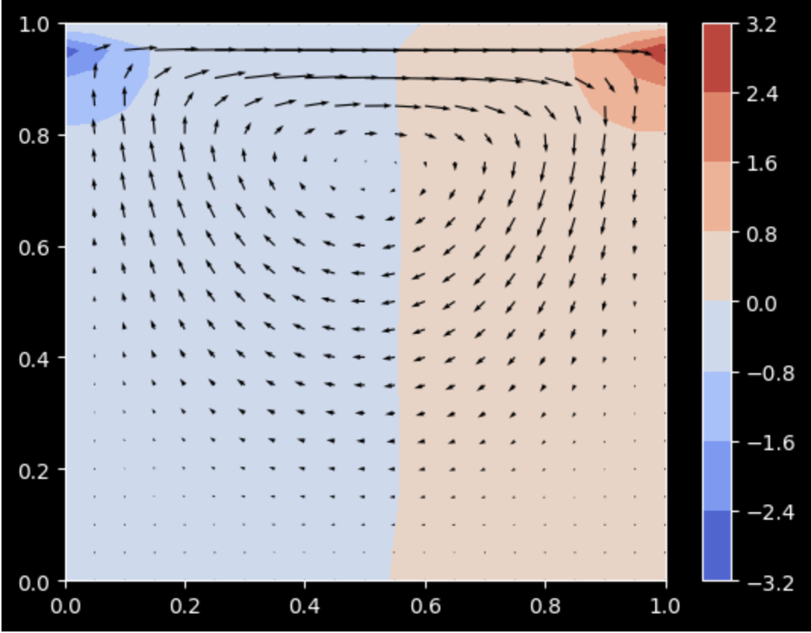

# Lid Driven Cavity Incompressible Navier Stokes Equation Solution

  

Solution to the incompressible Navier Stokes Equations in a Lid-Driven Cavity using finite differences, explicit timestepping and Chorin's Projections. 

# Method
Section describes the equations and method used to write up the simulation. 

## basic equations

The solution is based off Navier Stokes Equation particularly:

$$\frac{\partial u}{\partial t} + (u \cdot \nabla)u = \frac{-1}{\rho} \cdot \nabla \rho + \nu \cdot \nabla^{2}u + f $$

Incompressibility Equation in the simulation is based on:

$$\nabla \cdot u = 0 $$ 

where:
 - u: Velocity (assumed to be a 2D vector)
 - p: pressure
 - f: Forcing
 - $\rho$: Density 
 - $\nu$: Kinematic Viscosity 
 - t: Time
 - $\nabla$: Nonlinear Convection as well as divergence and gradient
 - $\nabla^{2}$: Laplace Operator 

 The box will start the simulation as a Homogenuous Dirichlet Boundary Condition as seen below : 

  

There are also a few assumptions we will make:
- Velocity and Pressure have zero initial condition
- There is homogenuous Dirichlet boundary conditions everywhere except for horizontal velocity at top. It is driven
by external flow.

## solution

The solution is inspired by the Projection Method, or in other words, *Chorin's Splitting*.

The simulation starts off by setting velocities as:

$$ u = [u, v]$$

$$ x = [x, y]$$

1) The simulation solves the Momentum Equation without a Pressure Gradient for tentative velocity given boundary conditions:

$$\frac{\partial u}{\partial t} + (u \cdot \nabla) \cdot u = \nu \nabla^{2}\cdot u $$

$$\frac{\partial u}{\partial t} + u \cdot \frac{\partial u}{\partial x} + v \cdot \frac{\partial u}{\partial y} = \nu \frac{\partial^{2}u}{\partial x^{2}} + \nu \cdot \frac{\partial^{2}u}{\partial y^{2}}$$

$$\frac{\partial u}{\partial t} + u \cdot \frac{\partial u}{\partial x} + v \cdot \frac{\partial u}{\partial y} = \nu \frac{\partial^{2}v}{\partial x^{2}} + \nu \cdot \frac{\partial^{2}v}{\partial y^{2}}$$

2) The simulation will then move on to solving the Pressure Poission Equation for pressure at the next point in time with homogeneous Boundary Conditions everywhere except at the top where it is homogeneous Dirichlet:

$$\nabla^{2}\rho = \frac{\rho}{\Delta t} \nabla \cdot u $$

$$\frac{\partial^{2}\rho}{\partial x^{2}} + \frac{\partial^{2}\rho}{\partial y^{2}} = \frac{\rho}{\Delta t} (\frac{\partial y}{\partial x} + \frac{\partial v}{\partial y}) $$

3) In the end of the iteration for each grid point across the grid, the sim will correct the velocities and enforce again the Velocity Boundary Conditions:

$$ u = u - \frac{\Delta t}{\rho} \cdot \nabla \cdot \rho $$ 

or more explicitly,

$$ u = u - \frac{\Delta t}{\rho} \frac{\partial \rho}{\partial x}$$

$$v = v - \frac{\Delta t}{\rho} \frac{\partial \rho}{\partial y}$$

## things to consider

a) The Variables can be played around in the second cell, but can lead to instability where the solution may not be accurate. There is error handling setup if that occurs.
b) Expected Solution: Swirling of fluid

## Inspiration

Inspiration by: http://home.iitj.ac.in/~k.r.hiremath/teaching/Lecture-notes-PDEs/node26.html 